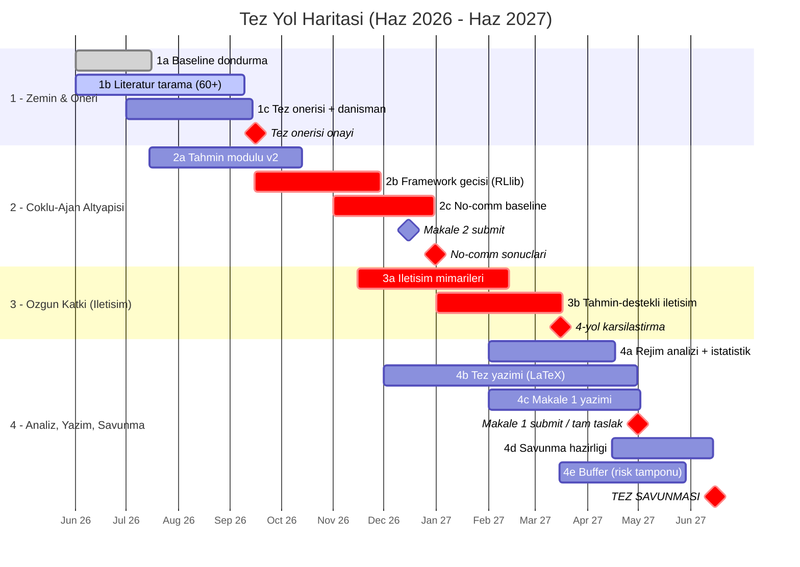
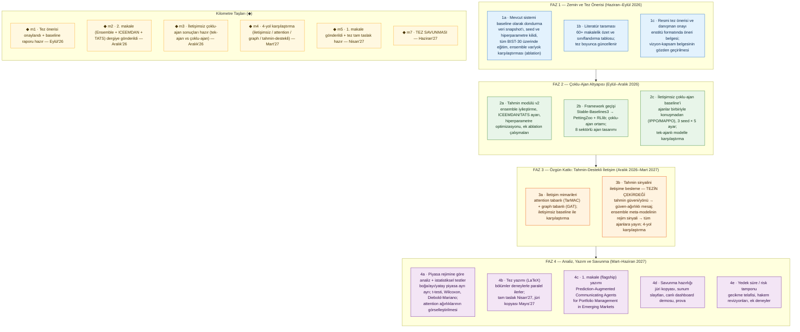

# Seminer / Danışman Görüşmesi — Proje Tanıtım Belgesi

**Proje:** RL Trading — BIST-30 için Derin Pekiştirmeli Öğrenme Tabanlı Portföy/İşlem Sistemi
**Öğrenci:** (ad-soyad)
**Danışman:** (ad-soyad)
**Belge amacı:** Danışman değerlendirmesi ve seminer dersi sunumu öncesi projenin bütününü tek belgede özetlemek — bugüne kadar yapılanlar (Faz 1-3) ve tez vizyonu (çoklu-ajan + iletişim + tahmin entegrasyonu).
**Tarih:** 2026-05

> Detaylı kaynaklar: `docs/thesis/vision-and-scope.md` (vizyon, literatür, kapsam, milestone'lar), `docs/development/roadmap.md` (faz geçmişi), `docs/development/prediction-system.md`, `docs/development/phase3-implementation.md`, `docs/guides/ACADEMIC_GUIDE.md`.

---

## 1. Tek Cümlede Proje

BIST-30 hisselerinde, derin pekiştirmeli öğrenme (DRL) ile alım-satım kararı veren; bu kararı bir **çok-modelli tahmin (ensemble forecasting) katmanıyla** zenginleştiren; gürültü filtreleme, trend düzeltme, risk-ayarlı pozisyon boyutlandırma ve açıklanabilirlik (SHAP) modüllerini içeren bir araştırma sistemi. Mevcut hâli **tek-ajanlı**; tezin hedefi bunu **sektör-bazlı çoklu-ajan + ajanlar arası öğrenilmiş iletişim** paradigmasına evirmek.

---

## 2. Motivasyon ve Problem

**Portföy/işlem problemi:** Belirli bir bütçeyle, çoklu riskli varlık arasında zaman içinde alım-satım/ağırlık kararı vermek. Klasik yöntemler (Markowitz, Black-Litterman, Risk Parity) parametrik varsayımlara (normallik, durağan kovaryans) dayanır; gerçek piyasa (rejim değişimleri, fat-tail, likidite şokları, Türkiye özelinde yüksek enflasyon ve TL volatilitesi) bu varsayımları sık bozar.

**Neden DRL:** Model-serbest yaklaşım — ajan piyasayı önceden modellemeden, getiri-risk ödünleşimini doğrudan deneyimle öğrenir. 2023-2026'da bu alan olgunlaştı (FinRL, ElegantRL gibi açık kaynak çatılar).

**Neden tek-ajan yetmiyor (tezin çıkış noktası):**
1. **Ölçeklenme:** Varlık sayısı arttıkça state/action uzayı büyür; BIST-30'da state ~800'ü aşar.
2. **Heterojenlik:** Tek politika "banka hissesi" ile "teknoloji hissesi" için aynı mekanizmayı kullanır; sektörel dinamik farklarını (beta, faiz duyarlılığı) çözmek zor.
3. **Koordinasyon/iletişim yok:** Varlıklar arası korelasyon yapısı yalnızca observation'a "çakılı" durur; haber/etki akışı açıkça modellenmez.
4. **Yorumlanabilirlik sınırlı:** Tek ajanın neden o hisseye ağırlık verdiği yalnızca feature-importance ile kısıtlı biçimde açıklanır.

**Tezin araştırma sorusu:**
> BIST-30 portföy yönetiminde, her sektörün bağımsız bir ajan olarak modellendiği ve ajanlar arasında **tahmin-destekli iletişimin** bulunduğu çoklu-ajan RL çerçevesi, tek-ajanlı alternatiflere göre (i) risk-ayarlı getiri, (ii) piyasa rejimlerine uyum, (iii) yorumlanabilirlik açısından ne düzeyde üstünlük sağlar?

Alt sorular: **AQ1** hangi iletişim mimarisi (no-comm / attention / graph) en iyi? · **AQ2** ensemble tahmin sinyalini (güven, yön, rejim) iletişime beslemek koordinasyonu nasıl etkiler? · **AQ3** iletişimin değeri boğa/ayı/yatay rejimde nasıl değişir?

---

## 3. Bugüne Kadar Yapılanlar — 3 Faz (Tamamlandı)

Ana referans (Faz 1-3): **Ansari et al. (2024)** — *"A Multifaceted Approach to Stock Market Trading Using Reinforcement Learning"* metodolojisi BIST-30'a uyarlandı ve genişletildi.

### Faz 1 — Proof of Concept
- 5 hisse (AKBNK, THYAO, TUPRS, BIMAS, ASELS), Gymnasium tabanlı çok-hisseli işlem ortamı.
- Stable-Baselines3 ile A2C / PPO / TD3.
- 5 teknik indikatör (Ansari seti: MACD, RSI, CCI, ADX, vb.), 56-boyutlu state space (bakiye + sahip olunan hisseler + OHLCV + indikatörler).
- FastAPI backend + ilk web arayüz, TensorBoard log, metrikler (Sharpe, Return, Drawdown).
- **Çıktı:** Çalışan tek-ajan RL baseline + dashboard.

### Faz 2 — Çok-Modelli Tahmin Sistemi (Multifaceted Prediction)
Ansari metodolojisinin tam uygulaması + tahmin katmanı:
- **Veri katmanı:** OHLCV (yfinance, retry + incremental + coverage check) · Makro (TCMB EVDS: faiz, enflasyon + yfinance: USD/TRY, EUR/TRY, BIST100) · Fundamental (yfinance: ROE, ROA, P/E, P/B, D/E, kâr marjı...) · Altın/döviz.
- **Feature engineering v2:** 10 özellik grubu (getiri, volatilite, momentum, makro, fundamental, rejim, ...), tümü en az 1 gün gecikmeli — **leakage yok**.
- **Feature selector:** Mutual information + permutation importance ile 3 aşamalı otomatik seçim.
- **Çok-modelli tahmin:** XGBoost + LightGBM + CatBoost + BiLSTM (PyTorch/CUDA) + Temporal Fusion Transformer.
- **Stacking ensemble:** Ridge / XGBoost meta-learner; **3-yönlü kronolojik bölme (60/20/20)** ile base-train / OOF meta-train / final-test — data leakage yok.
- **HPO:** Optuna (TPE sampler + median pruner, TimeSeriesSplit CV).
- **Walk-forward eğitim:** Purge gap (5 gün) + embargo (3 gün), her fold'da `prev_test_end` takibiyle.
- **RL entegrasyonu:** Observation space'e tahmin özellikleri eklendi — sembol başına +4 feature: tahmini getiri, tahmini yön, tahmin güveni, ensemble uyumu.
- **PSR reward:** Ansari Eq. 1 (`env/reward_functions.py`).
- **Dashboard:** Dash (Plotly) — 8 sayfa (home, training, data, models, daily_trading, prediction, academic, hyperopt), FastAPI `/dash/` altına mount.
- **Çıktı:** Tahmin-destekli tek-ajan RL sistemi + tam dashboard.

### Faz 3 — Production İyileştirmeleri
- **3.1 Bug fix'ler:** PSR reward `total_trades` sayım hatası giderildi · meta-learner data leakage 3-yönlü bölmeyle çözüldü · embargo her fold'da doğru uygulanıyor · TFT VSN değişken sınırı kaldırıldı · direction head (BiLSTM/TFT sigmoid çıktısı confidence'ta kullanılıyor) · permutation importance feature selector'a entegre edildi.
- **3.2 Tahmin kalitesi:** ICEEMDAN gürültü filtreleme (`prediction/iceemdan_processor.py`) · TATS trend-adjusted düzeltici (`prediction/tats.py`) · global makro göstergeler **VIX, US10Y, DXY** (`macro_fetcher.py` + `feature_engineer.py`).
- **3.3 Risk yönetimi:** ATR tabanlı dinamik pozisyon boyutlandırma (`use_atr_sizing`) · Kelly Criterion (quarter-Kelly, `use_kelly`) — ikisi de opt-in, mevcut eğitimli modelleri bozmaz.
- **3.4 Açıklanabilirlik & izleme:** SHAP explainability (`prediction/explainability.py`, `/prediction/explain/{symbol}` API) · Sortino, Calmar, **Deflated Sharpe Ratio** (Bailey & López de Prado), Turnover metrikleri.
- **Çıktı:** Faz 2 sisteminin production-grade kalitede düzeltilmiş, zenginleştirilmiş sürümü.

---

## 4. Sistem Mimarisi (Üst Düzey)

```
                 ┌──────────────── VERİ KATMANI ────────────────┐
yfinance  ───────│ OHLCV (data_fetcher.py)                       │
TCMB EVDS ───────│ Makro: faiz, enflasyon (macro_fetcher.py)     │
yfinance  ───────│ Döviz, BIST100, VIX, US10Y, DXY               │
yfinance  ───────│ Fundamental: ROE/ROA/PE/PB... (fund_fetcher)  │
borsapy/yf───────│ Altın / döviz (gold_fetcher.py)               │
                 └───────────────────┬──────────────────────────┘
                                     ▼
            feature_engineer.py  (10 grup özellik, ICEEMDAN, ≥1 gün gecikme)
                                     ▼
            feature_selector.py  (MI + permutation importance, 3 aşamalı)
                                     ▼
   ┌─────────────────── TAHMİN KATMANI ───────────────────┐
   │ XGBoost  LightGBM  CatBoost  BiLSTM  TFT              │
   │            │ (walk-forward + purge gap + embargo)     │
   │            ▼                                          │
   │     Stacking ensemble (Ridge / XGB meta, 3-yönlü split)│
   │            ▼  TATS düzeltici                           │
   │     Çıktı: predicted_return, direction, confidence,    │
   │            ensemble_agreement   + SHAP açıklaması       │
   └────────────────────┬──────────────────────────────────┘
                        ▼  (sembol başına +4 feature)
   ┌─────────────────── RL KATMANI ───────────────────────┐
   │ env/trading_env.py  (Gymnasium, çok-hisse)            │
   │   state: bakiye + hisseler + OHLCV + indikatör + tahmin│
   │   reward: PSR (Ansari Eq.1)                            │
   │   risk:  ATR sizing + Kelly criterion (opt-in)        │
   │   ajan:  Stable-Baselines3 — A2C / PPO / TD3          │
   └────────────────────┬──────────────────────────────────┘
                        ▼
   evaluator.py: Sharpe, Sortino, Calmar, Deflated Sharpe, PF, IC, Turnover, MaxDD
   tracker.py:  experiment log (JSON)
   ───────────────────────────────────────────────────────
   Sunum/izleme: FastAPI backend + Dash dashboard (/dash/), /prediction/explain API
```

**Teknoloji yığını:** FastAPI + Uvicorn · Stable-Baselines3 (A2C/PPO/TD3) + Gymnasium + PyTorch · XGBoost / LightGBM / CatBoost / BiLSTM / TFT + stacking · Optuna (HPO) · yfinance / pandas-ta / scikit-learn / pandas / numpy / evds · Dash (Plotly) + dash-bootstrap-components · SHAP · EMD-signal (ICEEMDAN).

---

## 5. Tezde Yapılacaklar — Çoklu-Ajan + İletişim Vizyonu

Hedef: tek-ajanlı sistemi **sektör-bazlı (~8 ajan: Banka, Enerji, Sanayi, Perakende, Holding, Telekom, Teknoloji, Diğer) çoklu-ajan RL**'e taşımak; ajanlar arası **öğrenilmiş iletişim** eklemek; **ensemble tahmin sistemini bu iletişime beslemek** (özgün katkı).

### Tasarım eksenleri (seçenekler donduruldu, fizibiliteyle netleşecek)
| Eksen | Donmuş seçenekler | İlk tercih |
|---|---|---|
| Ajan granülaritesi | (A) hisse-bazlı N=30 · (B) sektör-bazlı ~8 · (C) hiyerarşik | **B** + sektör içi eşit/risk-parity ağırlık |
| İletişim mimarisi | (1) no-comm IPPO · (2) attention (TarMAC-benzeri) · (3) GNN/GAT · (4) öğrenilmiş discrete (DIAL) | **1 + 2 + 3** karşılaştırılır; 4 future work |
| Ödül tasarımı | (α) tam kooperatif · (β) bencil · (γ) karışım · (δ) risk-ayarlı + turnover cezası | **γ** temel, **δ** ablation |
| Tahmin entegrasyonu | (I) ham feature (mevcut) · (II) iletişim kanalına besleme (trust-weighted) · (III) meta-learner → rejim broadcast | **II + III** — tezin çekirdeği |
| Framework | (F1) SB3 + custom wrapper · (F2) PettingZoo + RLlib · (F3) MARLlib/Tianshou · (F4) FinRL-Meta | **F2**; mevcut SB3 kodu baseline kalır |

**Özgün katkı (yayın potansiyeli yüksek):** Her ajanın kendi tahmin güvenini/yönünü diğerlerine mesaj olarak göndermesi; düşük güvenli ajanın diğerlerine daha çok "kulak vermesi" (confidence/trust ile modüle edilen attention). Literatürde doğrudan karşılığı yok.

### Literatürdeki boşluk (tezin yeri)
- MARL-finansta **iletişim mimarileri karşılaştırması** neredeyse hiç yok — genelde tek mimari seçilip baseline'a karşı test ediliyor.
- Tahmin sistemi entegrasyonu **sığ** — observation'a ek feature, iletişime besleme yok.
- **Gelişen piyasalar** (özellikle BIST) üzerinde multi-agent DRL çalışması yok denecek kadar az.
- **Rejim-bağımlı analiz** (iletişimin faydası boğa/ayıda nasıl değişir) araştırılmamış.

### Kapsam (net sınırlar)
**Dahil:** BIST-30 günlük OHLCV (2018-2026) + makro/fundamental/altın + ICEEMDAN · 5-model ensemble + TATS + SHAP · tek-ajan baseline (mevcut) + sektör-bazlı MARL + 3 iletişim mimarisi + prediction-augmented communication · Sharpe/Sortino/Calmar/DSR/Turnover/MaxDD, walk-forward + purge/embargo, rejim-bazlı ablation, istatistiksel test (t-test, Wilcoxon, Diebold-Mariano) · reprodüktibilite (veri snapshot, seed kilidi, experiment tracker, LaTeX tablo/figür).
**Dışında:** intraday/HFT · türev ürünler · short selling · canlı para · BIST dışı borsalar · LLM-sentiment · öğrenilmiş discrete protokoller (DIAL/RIAL) · derin hiyerarşik (feudal) MARL.

### Milestone haritası
| MS | Süre | İçerik | Çıktı |
|---|---|---|---|
| **0** | 0-3 hafta | Mevcut Faz 1-3'ü "kanonik baseline" olarak dondur; veri snapshot, seed/hyperparam kilidi; full BIST-30 (30 hisse, 200K step, 3 seed) eğitimi; ensemble DT vs DTF ablation | Tez Böl. 4 taslağı + Makale 2 ham materyali |
| **1** | 3-5 hafta | Genişletilmiş literatür taraması (60+ makale); resmi tez önerisi; danışman revizyonu; Makale 2 ilk taslak | Tez Böl. 1-3 taslağı |
| **2** | 5-11 hafta | SB3 → PettingZoo+RLlib geçişi; sektör-bazlı (~8 ajan) ortam; IPPO no-comm baseline; attention communication; tek-ajan vs no-comm vs attention | Tez Böl. 5 taslağı + Makale 1 çekirdek deneyler |
| **3** | 11-16 hafta | GNN (PyG + GAT) communication; prediction confidence → message weight; meta-learner rejim broadcast; 4-yol karşılaştırma; rejim-bazlı ablation; attention görselleştirme | Tez Böl. 6-8 taslağı + Makale 1 & 3 ham materyali |
| **4** | 16-20 hafta | Tez tamamlanması; Makale 1 submit; Makale 3 taslak; Makale 4 (Türkçe, ulusal); LaTeX figür paketi; savunma slaytları + demo | Tez teslim + makale submission'lar |

### Akademik çıktı planı
- **Tez (çalışma başlığı):** *"Çoklu-Ajan Pekiştirmeli Öğrenmede Tahmin-Destekli İletişim: BIST-30 Portföy Yönetimi İçin Mimari Karşılaştırma"*
- **Makale 1 (flagship):** *Prediction-Augmented Communicating Agents for Portfolio Management in Emerging Markets* → Expert Systems with Applications / Applied Soft Computing (Q1)
- **Makale 2 (erken yayın):** *Ensemble Prediction with ICEEMDAN Denoising and TATS Correction for RL Trading: A BIST-30 Study* → Neurocomputing / Knowledge-Based Systems (Q1) — Milestone 1 sonu taslak
- **Makale 3:** *Trust-Weighted Message Passing in Multi-Agent Portfolio Management* → Information Sciences / IEEE TNNLS (Q1)
- **Makale 4 (ulusal, düşük risk):** Türkçe — Politeknik Dergisi / Gazi MMF / Hacettepe Ekonomi

---

## 6. Yapılabilirlik ve Riskler

**Hesaplama (RTX 4060 8GB üzerinde):** tek-ajan baseline ~30 dk · ensemble (5 model, walk-forward) ~2 saat/fold · MARL IPPO (8 ajan, 200K step) ~1-2 saat · +attention ~3-4 saat · +GNN ~4-6 saat · +prediction-augmented ~4-8 saat. Her mimari × 3 seed × 5 ablation ≈ 150-300 saat net eğitim → 2-4 haftaya dağıtılabilir, **yapılabilir**.

**Veri/bellek:** BIST-30 × 8 yıl × tüm feature ≈ 200 MB · replay buffer (8 ajan × 1M transition) ≈ 3-5 GB RAM · checkpoint'ler (8 ajan × 3 mimari × 3 seed) ≈ 5-10 GB disk.

**Framework geçişi:** `env/trading_env.py` tek-ajan → PettingZoo uyumlu `env/marl_trading_env.py` yeniden yazılmalı; reward ajan-başına; RLlib kendi log formatını kullanır. Tahmini 1-2 hafta.

**Başlıca riskler ve azaltmalar:** MARL convergence (param sharing, baseline'dan warm-start, küçük LR) · PyG/RLlib version uyumsuzluğu (requirements dondur, Docker opsiyonu) · 8 sektör ajanı kötü sonuç verirse (4-5 gruba düş) · prediction-comm entegrasyonu kırılgan (önce feature olarak test, sonra comm'a taşı) · tez süresi aşımı (her milestone'da "checkpoint kararı", gecikirse kapsam daralt) · out-of-sample rejim kayması (limitation olarak açıkça raporla).

---

## 7. Başarı Kriterleri

Tez "başarılı" sayılması için aşağıdakilerin **en az %80'i**:
- [ ] Ansari et al. (2024) replikasyonu BIST-30'da gösterildi (baseline).
- [ ] 8-sektör MARL çerçevesi implement edildi; no-comm baseline çalışıyor.
- [ ] En az 2 iletişim mimarisi (attention + GNN) karşılaştırıldı.
- [ ] Comm-enabled varyant baseline'a göre Sharpe'da **istatistiksel anlamlı (p<0.05)** iyileşme.
- [ ] Tahmin sistemi iletişime entegre edildi ve ablation yapıldı.
- [ ] Rejim-bazlı (boğa/ayı/yatay) analiz raporlandı.
- [ ] Attention ağırlıkları / communication patterns nitel yorumlandı.
- [ ] Walk-forward out-of-sample testler tutarlı.
- [ ] LaTeX rapor + figürler tez formatında hazır.
- [ ] En az 1 uluslararası makale submit / en az 1 ulusal makale yayında.

---

## 8. Danışmanla Tartışmaya Açık Noktalar

1. **Ajan granülaritesi:** Sektör-bazlı (~8 ajan) yeterince özgün mü, yoksa hiyerarşik (sektör allocator + hisse selector) riske değer mi?
2. **İletişim mimarisi sayısı:** 3 mimari karşılaştırması (no-comm / attention / GNN) tez ölçeği için doğru mu, yoksa 2'ye mi indirilmeli?
3. **Erken yayın stratejisi:** Makale 2'yi (ensemble + ICEEMDAN + TATS) Milestone 1'de submit etmek mantıklı mı?
4. **Veri dönemi:** 2018-2026 aralığı (pandemi + yüksek enflasyon dönemi dahil) rejim-bazlı analiz için yeterli mi; daha geriye gidilmeli mi?
5. **Baseline kapsamı:** Ansari replikasyonuna ek olarak klasik baseline'lar (buy&hold, equal-weight, mean-variance) eklensin mi?
6. **Framework riski:** PettingZoo + RLlib geçişi mi, yoksa SB3 üzerinde custom multi-agent wrapper mı (geçiş maliyeti vs. mimari esneklik)?

---

---

## 8.5. 12 Aylık Zaman Planı — Gantt Chart (Haziran 2026 → Haziran 2027)

**Başlangıç:** 2026-06 · **Tez savunması:** 2027-06 · **Çalışma modeli:** Hem yüksek lisans tez aşamaları (literatür → öneri → metodoloji → deney → yazım → savunma) hem de bir MVP yazılım projesi (baseline dondurma → framework geçişi → mimari implementasyonu → entegrasyon → değerlendirme → paketleme) iç içe yürütülür.

> **Görsel üretimi:** Aşağıdaki Mermaid bloklarını **mermaid.live**'a yapıştır → sağ üstten **"Light" tema** → Actions → **PNG/SVG** indir. Word dokümanına veya sunum slaytına resim olarak ekle. (Daha önce burada bulunan ASCII Gantt kaldırıldı — eşit-genişlikli font olmadan hizalanmadığı için karmaşık görünüyordu; Mermaid PNG her yerde düzgün çıkar.)

**1) Takvim Gantt'ı — zaman ekseni + kilometre taşları:**

> Görev adları kasıtlı **kısa** tutuldu (uzun metin bar'ları okunmaz hale getiriyor); detaylı açıklamalar hemen aşağıdaki "Adım açıklamaları" tablosunda ve "2) Faz kartı" görselinde. `active` = şu an çalışılan, `crit` = kritik yol (gecikirse tez kayar), `done` = tamamlanmış zemin işi, ◆ = milestone.



**Adım açıklamaları (Mermaid'deki kısa kodların karşılığı):**

| Kod | Adım | Açıklama |
|---|---|---|
| **1a** | Baseline'ı dondurma | Mevcut Faz 1-3 sistemini "kanonik baseline" olarak sabitle: veri snapshot'ı (parquet), seed + hiperparametre kilidi, tüm BIST-30 (30 hisse, 200K adım, 3 seed) eğitimi, ensemble var/yok karşılaştırması (ablation: DT vs DTF) |
| **1b** | Literatür taraması | 60+ makalelik özet/taksonomi tablosu (MARL + portföy + iletişim + tahmin); süreç boyunca güncellenir |
| **1c** | Tez önerisi + danışman | Enstitü formatında resmi tez önerisi dokümanı; `vision-and-scope.md`'nin danışmanla gözden geçirilmesi ve onayı |
| **2a** | Tahmin modülü v2 | Ensemble iyileştirme, ICEEMDAN/TATS hiperparametre ayarı, hiperparametre optimizasyonunu (HPO) derinleştirme, ek ablation çalışmaları |
| **2b** | Framework geçişi | SB3 → PettingZoo + RLlib; `env/marl_trading_env.py` (çok-ajan ortam) yazımı; 8-sektör ajan tasarımı |
| **2c** | No-comm baseline | İletişimsiz çok-ajan baseline (IPPO/MAPPO), 3 seed × 5 konfig; tek-ajan baseline ile karşılaştırma |
| **3a** | İletişim mimarileri | Attention (TarMAC-benzeri) + graf (GAT) iletişim mimarilerinin implementasyonu ve no-comm ile karşılaştırması |
| **3b** | Tahmin-destekli iletişim | **Tezin çekirdeği:** tahmin güveni/yönü → güven-ağırlıklı mesaj; meta-learner rejim sinyali → broadcast; 4-yol karşılaştırma |
| **4a** | Rejim analizi + istatistik | Boğa/ayı/yatay piyasayı ayrı ayrı inceleme + istatistiksel anlamlılık testleri (t-testi, Wilcoxon, Diebold-Mariano) + attention ağırlıklarının görselleştirilmesi |
| **4b** | Tez yazımı | LaTeX; bölümler deneylerle paralel ilerler, tam taslak Nis'27, jüri kopyası May'27 |
| **4c** | Makale 1 yazımı | Flagship: *Prediction-Augmented Communicating Agents for Portfolio Management in Emerging Markets* |
| **4d** | Savunma hazırlığı | Jüri kopyası, slaytlar, canlı dashboard demo, prova |
| **4e** | Buffer | Risk tamponu — gecikme telafisi, hakem revizyonu, ek deney |
| ◆ **m1** | Tez önerisi onayı | + kanonik baseline raporu hazır (Eyl'26) |
| ◆ **m2** | Makale 2 submit | Ensemble + ICEEMDAN + TATS makalesi dergiye gönderildi (Ara'26) |
| ◆ **m3** | No-comm sonuçları | Tek-ajan vs no-comm çok-ajan karşılaştırması hazır (Ara'26) |
| ◆ **m4** | 4-yol karşılaştırma | no-comm / attention / GNN / tahmin-destekli sonuçları (Mar'27) |
| ◆ **m5** | Makale 1 submit + tam taslak | Flagship makale gönderildi, tez tam taslak hazır (Nis'27) |
| ◆ **m7** | Tez savunması | Haz'27 |

**2) Faz kartı — adımların açıklamalı dökümü (Mermaid `flowchart`; Gantt PNG'sinin yanına ikinci bir PNG olarak indir):**

> Gantt grafiğinde sadece `1a, 2b, 3b...` kısa kodları görünür; bu kart o kodların ne anlama geldiğini renkli bloklar halinde gösterir — sunumda Gantt'ı bir slayda, bu kartı yanına/sonrasına koyabilirsin. mermaid.live'a yapıştır → Light tema → PNG indir. (Mermaid'in gerçek tablo desteği yok; bu yüzden flowchart grid'i kullanıyoruz — çıktı düzgün bir kart panosu olur.)

> Not: "ablation (ayrıştırma analizi)" = sistemin her bileşenini tek tek çıkarıp/ekleyip o bileşenin sonuçlara katkısını ölçme (örn. "ensemble'lı vs ensemble'sız", "iletişimli vs iletişimsiz"). Genel kabul görmüş İngilizce terimler (seed, snapshot, baseline, ensemble, attention, framework, walk-forward, drawdown) olduğu gibi bırakıldı.



> **Mermaid kullanım notu:** Kodu **mermaid.live**'a yapıştır, "Actions → PNG/SVG" ile indir. Render koyu görünüyorsa **mermaid.live'da sağ üstten "Light" temaya** geç (kod içine tema gömmüyoruz — uzun `themeVariables` blokları çoğu viewer'da bozuk görünüyor; varsayılan açık tema en temizidir). VS Code'da "Markdown Preview Mermaid Support" eklentisi de açık temayla düzgün gösterir. PowerPoint için PNG yeterli; istersen mermaid.live'da fontu büyüt (Config sekmesi → `fontSize`).

**Faz özetleri (4 büyük blok):**

| Faz | Aylar | İçerik | Ana teslim |
|---|---|---|---|
| **F-A — Zemin & Öneri** | Haz–Eyl'26 | Baseline dondurma (WP0), literatür (WP1), tez önerisi onayı (WP2), tahmin modülü iyileştirme başlangıcı (WP3) | Onaylı tez önerisi + kanonik baseline raporu + Tez Böl. 1-4 taslağı |
| **F-B — MARL Altyapısı** | Eyl–Ara'26 | Tahmin modülü v2 tamam (WP3), framework geçişi (WP4), no-comm baseline (WP5), Makale 2 submit (WP9) | Çalışan sektör-bazlı MARL ortamı + no-comm sonuçları + Makale 2 submission |
| **F-C — Özgün Katkı** | Ara'26–Mar'27 | İletişim mimarileri (WP6), prediction-augmented communication (WP7) — tezin kalbi | 4-yol karşılaştırma (no-comm/attention/GNN/prediction-augmented) sonuçları + Tez Böl. 5-7 |
| **F-D — Analiz, Yazım, Savunma** | Mar–Haz'27 | Rejim-bazlı ablation (WP8), tez yazımı tamamlama (WP10), Makale 1 submit (WP9), savunma (WP11), buffer (WP12) | Tez teslim + Makale 1 submission + başarılı savunma |

**Kritik checkpoint kararları (gecikirse kapsam daralt):**
- **Eyl'26 sonu:** Tez önerisi onaylanmadıysa → literatür/öneri 1 ay daha, MARL geçişi öne çekilmez.
- **Ara'26 sonu:** No-comm baseline çalışmıyorsa → sektör ajan sayısını 8→4-5'e düşür, GNN'i opsiyonel yap.
- **Mar'27 sonu:** Prediction-augmented communication sonuç vermiyorsa → 3 mimari karşılaştırması (no-comm/attention/GNN) ile yetin, prediction-comm'u "preliminary results" + future work olarak yaz.
- **Nis'27 sonu:** Tez tam taslak hazır değilse → buffer (WP12) devreye, ek deney dondurulur, sadece yazım.

**MVP perspektifi (yazılım teslimleri):**
- Tem'26: dondurulmuş baseline (`results/baseline/`, reprodüksiyon scripti)
- Kas'26: `env/marl_trading_env.py` (PettingZoo uyumlu) + 8-sektör config
- Ara'26: no-comm MARL eğitim pipeline'ı (RLlib) + dashboard'a MARL sonuç sayfası
- Şub'27: attention + GNN iletişim mimarileri (custom RLlib policy)
- Mar'27: prediction → message-weight entegrasyonu + attention görselleştirme aracı
- My'27: tam reprodüksiyon paketi (requirements pin, seed kilidi, README, LaTeX figür üretim scriptleri)

---

## 8.6. Yayın / Poster / Sunum Çıktıları — Liste ve Hedef Mecralar

> Tezin modüler yapısı birden çok bağımsız çıktı üretmeye uygun. Aşağıdaki liste **öncelik sırasına ve risk düzeyine** göre düzenlendi. Q1/Q2 = Journal Citation Reports çeyrek; SCI-E/SSCI = indeks; TR Dizin = ULAKBİM ulusal indeks. Dergi isimleri öneri niteliğinde — submission öncesi scope/aim ve son sayılar kontrol edilmeli.

### 8.6.1. Hakemli Dergi Makaleleri

| # | Çalışma başlığı (çalışma sürümü) | İçerik / dayanak | Hedef dergi seçenekleri | Risk | Hedef tarih |
|---|---|---|---|---|---|
| **M1 — Flagship** | *Prediction-Augmented Communicating Agents for Portfolio Management in Emerging Markets* | Tezin özgün katkısı: sektör-bazlı MARL + trust-weighted communication + ensemble tahmin entegrasyonu, BIST-30 | *Expert Systems with Applications* (Q1) · *Applied Soft Computing* (Q1) · *Engineering Applications of Artificial Intelligence* (Q1) · *Knowledge-Based Systems* (Q1) | Yüksek (deney bağımlı) | Submit ~Nis-May'27 |
| **M2 — Erken yayın** | *Ensemble Prediction with ICEEMDAN Denoising and TATS Correction for Reinforcement Learning Trading: A BIST-30 Study* | Faz 2/3 sistemi + kanonik baseline; deneyleri zaten büyük ölçüde hazır | *Neurocomputing* (Q1) · *Knowledge-Based Systems* (Q1) · *Applied Intelligence* (Q2) · *Computational Economics* (Q2) · *Financial Innovation* (Q1, açık erişim) | Düşük-orta | Submit ~Kas-Ara'26 |
| **M3 — Yöntem makalesi** | *Trust-Weighted Message Passing in Multi-Agent Portfolio Management* | M1'in iletişim mekanizması kısmının derinleştirilmiş, mimari-odaklı sürümü (attention vs GNN ablation) | *Information Sciences* (Q1) · *IEEE Transactions on Neural Networks and Learning Systems* (Q1) · *Neural Networks* (Q1) · *Pattern Recognition* (Q1) | Yüksek | Taslak Mar'27, submit My-Haz'27+ |
| **M4 — Ulusal (TR Dizin)** | *Çoklu-Ajan Pekiştirmeli Öğrenme ile BIST-30 Portföy Yönetimi: Karşılaştırmalı Bir Analiz* | Tezin Türkçe özeti + temel karşılaştırma sonuçları | *Politeknik Dergisi* · *Gazi Üniversitesi MMF Dergisi* · *Pamukkale Üni. Mühendislik Bilimleri Dergisi* · *Journal of Intelligent Systems: Theory and Applications (JISTA)* · *Bilişim Teknolojileri Dergisi* | Düşük | Taslak Nis-May'27 |
| **M5 — Survey/inceleme (opsiyonel)** | *A Survey of Multi-Agent Reinforcement Learning for Financial Portfolio Management* | Literatür taramasının (WP1) genişletilmiş, taksonomi içeren sürümü — tez yazımının yan ürünü | *Artificial Intelligence Review* (Q1) · *ACM Computing Surveys* (Q1, davetli/zor) · *Expert Systems* (Q2) · *WIREs Data Mining and Knowledge Discovery* (Q1) | Orta (yazım yoğun) | Opsiyonel, savunma sonrası |
| **M6 — Veri/altyapı notu (opsiyonel)** | *An Open Macro-Financial Feature Pipeline for Turkish Equity Markets (BIST)* — kısa makale / data descriptor | EVDS + VIX/US10Y/DXY + fundamental pipeline'ın belgelenmesi, reprodüksiyon paketi | *Data in Brief* (Elsevier) · *SoftwareX* (Elsevier) · *Software Impacts* | Düşük | Opsiyonel, baseline dondurma sonrası (Ağu'26+) |

### 8.6.2. Konferans Bildirileri / Posterler

| # | Tür | Önerilen mecra | İçerik | Hedef tarih |
|---|---|---|---|---|
| **C1** | Tam bildiri / poster | **SIU** (IEEE Sinyal İşleme ve İletişim Uygulamaları Kurultayı) — ulusal+IEEE | Tahmin modülü + RL entegrasyonu özet sonuçları | ~Mayıs'27 (SIU genelde Mayıs) |
| **C2** | Tam bildiri / poster | **UBMK** (Uluslararası Bilgisayar Bilimleri ve Mühendisliği Konferansı) veya **ASYU** (Akıllı Sistemlerde Yenilikler ve Uygulamaları) | MARL mimarisi + no-comm baseline sonuçları | ~Ekim-Kasım'26 |
| **C3** | Workshop bildiri / poster | **ICAIF** (ACM Int'l Conf. on AI in Finance) — finans-AI'ın amiral konferansı | Prediction-augmented communication ön sonuçları | ~Kasım'26 veya '27 |
| **C4** | Poster / extended abstract | **AAMAS** (Int'l Conf. on Autonomous Agents and Multi-Agent Systems) — MARL'ın ana konferansı (extended abstract / demo track) | İletişim mimarileri karşılaştırması | ~Mayıs'27 (deadline Kasım'26 civarı — erken!) |
| **C5** | Poster | Üniversite/enstitü **lisansüstü araştırma günü** veya **TÜBİTAK / sektörel AI etkinlikleri** | Projenin genel tanıtımı (bu seminer sunumunun poster sürümü) | Yıl içinde uygun bir tarih |
| **C6** | Bildiri (opsiyonel, uluslararası) | **CIFEr** (IEEE Symp. on Computational Intelligence for Financial Engineering & Economics) veya **IJCNN / IEEE WCCI** | Tezin bir alt-bölümü (örn. ensemble + RL) | 2027 |

### 8.6.3. Diğer Çıktılar (akademik dışı / tamamlayıcı)

- **Açık kaynak repo + reprodüksiyon paketi** (GitHub) — baseline dondurulduğunda; M2/M6 makaleleriyle birlikte yayınlanır (DOI için Zenodo arşivi).
- **Dash dashboard'un canlı demo'su** — savunma ve poster sunumlarında interaktif gösterim.
- **Teknik blog yazısı / Medium serisi** (opsiyonel) — projenin görünürlüğü için, makale submission'lardan sonra.
- **Yüksek lisans tez metni** — enstitü formatında, açık erişim (YÖK Tez Merkezi).

### 8.6.4. Önerilen Yayın Stratejisi (sıra)

1. **Önce M2'yi çıkar (Kas-Ara'26):** Deneyleri hazır, risk düşük → ilk yayın garantisi, CV'ye erken katkı, tez Böl. 4'ün hakemli versiyonu.
2. **C2/C3 ile görünürlük (Eki-Kas'26):** MARL altyapısı çalışır çalışmaz bir konferans bildirisi → geri bildirim al, M1 öncesi "preliminary" damgası.
3. **M1 flagship'i tez deneyleri tamamlanınca (Nis-May'27):** Tezin ana katkısı; en yüksek hedef dergi.
4. **M3 ve M4'ü tez yazımıyla paralel taslakla (Mar-May'27):** M4 (Türkçe) düşük riskli, hızlı yayın; M3 savunma sonrasına sarkabilir.
5. **M5/M6 opsiyonel — vakit ve enerji kalırsa:** Survey ve data descriptor, tez/literatürün yan ürünü olarak değerlendirilir.

> **Not:** Hedef dergilerin güncel scope, ortalama hakem süresi (review turnaround) ve APC (açık erişim ücreti) durumu submission öncesi mutlaka kontrol edilmeli; özellikle Elsevier/IEEE Q1 dergilerde hakem süresi 3-9 ay olabileceği için M1'i Nisan'27'de submit etmek, kabul tez teslimine yetişmese de "submitted" statüsünü savunmada gösterebilmek için yeterli.

---

## 9. Sıkça Sorulabilecek Sorular ve Cevaplar (Q&A)

> Danışman görüşmesi ve seminer sırasında gelmesi muhtemel sorular. Cevaplar, savunmada doğrudan kullanılabilecek biçimde yazıldı.

### A. Kapsam ve Tasarım Tercihleri

**S1 — Neden BIST-30 hisseleri? Neden başka bir endeks / piyasa değil?**
- **Likidite ve veri kalitesi:** BIST-30, Borsa İstanbul'un en likit, en yüksek işlem hacimli hisseleri. yfinance üzerinden OHLCV verisi tutarlı; coverage check ile %80+ kapsama garanti ediliyor. Daha küçük hisselerde ince işlem (thin trading), boşluk ve fiyat sıçraması sorunları RL eğitimini bozar.
- **Sektörel çeşitlilik + makul ölçek:** BIST-30 içinde banka, enerji, sanayi, perakende, holding, telekom, teknoloji sektörleri temsil ediliyor — tezin sektör-bazlı çoklu-ajan tasarımı (~8 ajan) için doğal bir gruplama sağlıyor. Aynı zamanda 30 varlık, RL state/action uzayını yönetilebilir tutuyor (S&P500 gibi 500 varlık ile MARL pratik limitleri zorlardı).
- **Akademik boşluk:** Multi-agent DRL literatürü ezici çoğunlukla S&P500 / ETF üzerinde. BIST gibi bir gelişen piyasa (yüksek enflasyon, TL volatilitesi, TCMB faiz politikaları) üzerinde multi-agent DRL çalışması yok denecek kadar az — tezin özgün konumlanması buradan geliyor.
- **Ana referansla uyum:** Ansari et al. (2024) metodolojisi başka bir piyasada uygulandı; biz onu BIST'e uyarlayarak hem replikasyon yapıyoruz hem de yeni bir piyasada test etmiş oluyoruz.

**S2 — Bu sistem anlık (intraday) al-sat botu mu?**
- Hayır. Bu, **günlük frekansta** çalışan, bir **yatırım stratejisi / portföy yönetimi** çerçevesi. Amaç saniyelik fiyat hareketlerinden kâr çıkarmak (HFT) değil; makro, fundamental ve teknik bilgiyi birleştirerek **orta vadeli, risk-ayarlı bir varlık dağılımı politikası öğrenmek**. Karar birimi gün sonu kapanış verisi; ajan "bugün hangi hisselere ne kadar ağırlık" sorusuna cevap veriyor. Intraday/HFT, türev ürünler, kaldıraç ve short selling açıkça kapsam dışı (bkz. §4.2 / §5).
- Bu tercih bilinçli: günlük frekans makro/fundamental verinin anlamlı olduğu ölçek; ayrıca işlem maliyeti, slippage ve veri kalitesi açısından akademik olarak savunulabilir bir kurulum.

**S3 — Neden RL? Neden klasik portföy optimizasyonu (Markowitz, Black-Litterman) veya saf supervised learning değil?**
- **Klasik optimizasyona göre:** Markowitz/Black-Litterman parametrik varsayımlara dayanır (getiri normalliği, durağan kovaryans). Türk piyasası rejim değişimleri, fat-tail dağılımlar ve enflasyon şoklarıyla bu varsayımları sık bozar. RL model-serbest: piyasayı önceden modellemeden, sıralı karar problemini (her gün → aksiyon → ödül → yeni durum) doğrudan optimize eder; işlem maliyeti, pozisyon limitleri, turnover cezası gibi kısıtları ödül fonksiyonuna doğal biçimde gömebilir.
- **Saf supervised learning'e göre:** Bir tahmin modeli "yarın fiyat artacak mı?" sorusuna cevap verir ama "ne kadar pozisyon alayım, mevcut portföyümü nasıl ayarlayayım, riski nasıl yönetirim" sorularını çözmez. RL, tahmini bir **girdi** olarak kullanıp **eylem politikasını** öğreniyor. Bu yüzden ikisi rakip değil tamamlayıcı: bu projede supervised ensemble tahmin sistemi RL'in içine besleniyor (bkz. S8).
- **Literatür eğilimi:** 2023-2026'da DRL-portföy alanı olgunlaştı (FinRL, ElegantRL); Ansari et al. (2024) bu yaklaşımın güncel bir örneği.

### B. RL Algoritmaları

**S4 — Hangi RL algoritmalarını kullanıyorsunuz ve her biri kısaca nasıl çalışır?**

Stable-Baselines3 üzerinden üç algoritma destekleniyor: **PPO** (önerilen/varsayılan), **A2C**, **TD3**.

- **PPO (Proximal Policy Optimization):** On-policy bir policy-gradient yöntemi. Politikayı her güncellemede "çok fazla değişmesin" diye bir *clipped surrogate objective* ile sınırlar; böylece eğitim kararlı kalır, hiperparametrelere fazla duyarlı olmaz. Bizim için varsayılan — finansal verinin gürültülü ve non-stationary olduğu ortamda en güvenilir yakınsama profilini veriyor.
- **A2C (Advantage Actor-Critic):** PPO'nun daha basit, senkron atası. Actor (politika) ve critic (değer fonksiyonu) ağlarını avantaj tahminiyle birlikte günceller; clipping yok. Paralel ortamlarla çok hızlı eğitilir ama daha az kararlı, hiperparametre ayarına daha hassas — hız/baseline karşılaştırması için tutuyoruz.
- **TD3 (Twin Delayed DDPG):** Off-policy, deterministik politikalı, sürekli aksiyon uzayı için tasarlanmış aktör-kritik yöntemi. İki Q-ağı (twin) ile aşırı-iyimser değer tahminini bastırır, gecikmeli politika güncellemesi (delayed) ve hedef-aksiyon gürültüsüyle kararlılık sağlar; experience replay kullanır (örnek verimliliği yüksek). Sürekli pozisyon ağırlıkları için doğal bir aday.

**S5 — Neden diğer RL algoritmaları (SAC, DDPG, DQN, Rainbow, A3C, IMPALA...) seçilmedi?**
- **DQN / Rainbow / değer-tabanlı yöntemler:** Discrete aksiyon uzayı için tasarlandı. Portföy ağırlığı / pozisyon boyutu doğası gereği sürekli (continuous) — DQN ile ifade etmek için aksiyonu kabaca bölmek (örn. "al/sat/bekle") gerekir, bu da bilgi kaybı demek. Bu yüzden değer-tabanlı discrete yöntemler dışarıda.
- **DDPG:** TD3'ün atası; aynı problem ailesini çözer ama değer aşırı-tahmini ve hassas hiperparametreler nedeniyle daha kırılgan. TD3 onun "düzeltilmiş" hali olduğu için DDPG yerine TD3'ü tercih ediyoruz.
- **SAC (Soft Actor-Critic):** Güçlü bir off-policy continuous yöntem (entropi regularizasyonu, iyi örnek verimliliği). Kapsam dışı bırakma nedeni pratik: Ansari et al. (2024) referansının kullandığı algoritma ailesiyle hizalı kalmak, ve üç algoritmanın (on-policy stabil PPO + hızlı A2C + off-policy TD3) zaten paradigma çeşitliliğini kapsaması. SAC ileride kolay eklenebilir bir genişletme (`docs/guides/ALGORITHMS.md`'de yer tutucu var) — tezde gerekirse ablation'a dahil edilebilir.
- **A3C / IMPALA / dağıtık yöntemler:** Asıl avantajları büyük ölçekli paralel altyapı; tek-GPU akademik kurulumda kazanımları sınırlı, ek karmaşıklık değmiyor.
- **MARL-spesifik (MAPPO, QMIX, MADDPG):** Bunlar tezin **çoklu-ajan fazında** (Milestone 2+) devreye girecek — PettingZoo + RLlib üzerinden. Mevcut faz tek-ajanlı olduğu için henüz kullanılmıyor.
- **Özet konumlandırma:** "Tek bir algoritmaya bağlanmak yerine, üç farklı RL paradigmasından (stabil on-policy, hızlı on-policy, örnek-verimli off-policy) birer temsilci seçtik; bu hem sağlamlık karşılaştırması verir hem de Ansari referansıyla uyumludur."

### C. Tahmin Sistemi ve RL Entegrasyonu

**S8 — Tahmin aracı tam olarak RL modelinin neresinde kullanılıyor?**
- Tahmin sistemi, RL ajanının **gözlem uzayını (observation / state space) zenginleştiriyor** — yani RL'in *girdisinde*. RL ajanının ödül fonksiyonunda veya politika ağının iç mimarisinde değil.
- Somut olarak: her gün, her sembol için ensemble şu dört değeri üretiyor → **tahmini getiri (predicted_return)**, **tahmini yön (direction)**, **tahmin güveni (confidence)**, **ensemble uyumu (agreement)**. Bu dört değer (sembol başına +4 feature) RL state vektörüne ekleniyor. Faz 1'de state ~56 boyutluydu (bakiye + sahip olunan hisseler + OHLCV + teknik indikatörler); Faz 2'de buna +4×N tahmin özelliği eklendi.
- **Pipeline akışı:** `feature_engineer → feature_selector → 5-model walk-forward eğitim → stacking ensemble → TATS düzeltici → SHAP açıklama` → çıktı `env/trading_env.py` içindeki observation'a yazılıyor → RL ajanı (PPO/A2C/TD3) bu zenginleştirilmiş gözlemle karar veriyor.
- **Neden böyle?** Tahmin "yarın ne olur" bilgisini sağlıyor; RL "bu bilgiyle ne yapmalıyım" politikasını öğreniyor. Tahmini doğrudan aksiyona çevirmek yerine RL'e bir sinyal olarak vermek, ajanın tahmine *ne kadar güveneceğini* (özellikle confidence feature'ı sayesinde) ve onu diğer bilgilerle nasıl harmanlayacağını kendi öğrenmesini sağlıyor — tahmin yanıldığında sistem tamamen çökmüyor.
- **Tezde değişecek olan:** Şu an tahmin "ham feature" olarak gözleme giriyor (Seçenek I). Tezin özgün katkısında tahmin güveni/yönü, çoklu-ajan kurulumunda **ajanlar arası iletişim kanalına** beslenecek (Seçenek II — trust-weighted communication) ve ensemble meta-learner'ın rejim sinyali tüm ajanlara broadcast edilecek (Seçenek III). Yani entegrasyon noktası "gözlem" → "iletişim" yönünde derinleşecek.

**S9 — Neden 5 ayrı tahmin modeli + stacking? Tek bir güçlü model (örn. sadece XGBoost veya sadece TFT) yetmez mi?**
- Farklı model aileleri farklı hataları yapar: gradient boosting ailesi (XGBoost/LightGBM/CatBoost) tablo verisi ve doğrusal-olmayan etkileşimlerde güçlü; BiLSTM ve TFT zamansal bağımlılıkları yakalar. Stacking meta-learner, bu modellerin tahminlerini öğrenilmiş ağırlıklarla birleştiriyor — tek modelden daha düşük varyans, daha sağlam genelleme. Finansal seriler düşük sinyal/gürültü oranına sahip olduğu için "ensemble + denoising (ICEEMDAN) + trend düzeltme (TATS)" kombinasyonu tek modelden anlamlı fark yaratıyor. Ablation (DT vs DTF — ensemble'lı vs ensemble'sız) Milestone 0'da raporlanacak.
- Stacking'in kritik detayı: **3-yönlü kronolojik bölme (60/20/20)** — base modeller ilk dilimde, meta-learner OOF (out-of-fold) tahminlerle ikinci dilimde, final test üçüncü dilimde eğitiliyor; böylece meta-learner'a sızıntı (data leakage) yok.

### D. Veri, Değerlendirme, Yöntem

**S6 — Veri dönemi ne? Look-ahead bias / data leakage'a karşı ne yapıyorsunuz?**
- Dönem: 2018-2026 günlük veri (pandemi dönemi + yüksek enflasyon dönemi dahil — rejim-bazlı analiz için bilinçli seçim). Tüm türetilmiş özellikler **en az 1 gün gecikmeli** (bugünün kararında bugünün kapanışından sonra bilinen bilgi kullanılmıyor). Eğitim **walk-forward** yapılıyor: her fold'da geçmişle eğit, gelecekte test; iki ardışık fold arasında **purge gap (5 gün)** ve **embargo (3 gün)** ile sınır bölgesindeki örnekler atılıyor (`prev_test_end` takibiyle). Ensemble meta-learner için ayrıca 3-yönlü kronolojik bölme. Sonuçlar walk-forward out-of-sample; tek bir şanslı dönemden değil.

**S7 — Performansı nasıl ölçüyorsunuz? Sadece getiriye mi bakıyorsunuz?**
- Hayır — risk-ayarlı metrikler esas. Raporlanan metrikler: **Sharpe, Sortino, Calmar, Deflated Sharpe Ratio** (Bailey & López de Prado — çoklu deneme yapıldığında "şans eseri yüksek Sharpe" riskini düzeltir), **Profit Factor, Information Coefficient, Turnover, Max Drawdown**. Tezde ayrıca **istatistiksel anlamlılık testleri** (t-test, Wilcoxon işaretli sıra testi, Diebold-Mariano) ile karşılaştırmalar; rejim-bazlı (boğa/ayı/yatay) ablation. Baseline olarak Ansari replikasyonu; danışman onaylarsa klasik baseline'lar da (buy&hold, eşit-ağırlık, mean-variance) eklenebilir (bkz. §8 madde 5).

### E. Çoklu-Ajan Vizyonu

**S10 — Neden sektör-bazlı (~8 ajan)? Neden her hisse bir ajan (N=30) ya da hiyerarşik değil?**
- Üç seçenek de masada (§5 tablosu, vision-and-scope §3.1). **Sektör-bazlı** ilk tercih çünkü: (i) ~8 ajan, CTDE (centralized training, decentralized execution) critic ağının makul ölçekte sağlam eğitilmesini sağlar — 30 ajanlı MARL'de non-stationarity ve convergence ciddi sorun; (ii) sektörler aynı makro şoka benzer tepki verir, yani doğal bir gruplama; (iii) sektörler arası iletişim finansal olarak anlamlı (bulaşma/contagion, sektör rotasyonu); (iv) literatürde sektör-bazlı MARL az — özgünlük. Her-hisse-bir-ajan literatürde bol ve eğitimi zor; hiyerarşik (sektör allocator + hisse selector) en özgün ama tez süresinde bitirilememe riski en yüksek — Milestone 2 fizibilite sonunda hafif hiyerarşi (sektör içi eşit/risk-parity ağırlık) eklenip eklenmeyeceğine karar verilecek.

**S11 — Neden Stable-Baselines3'ten PettingZoo + RLlib'e geçiyorsunuz? Mevcut kodun üstüne multi-agent wrapper yazılamaz mı?**
- Yazılabilir (Seçenek F1) ama custom wrapper bakım yükü yüksek ve kırılgan; attention/GNN gibi özel politika mimarilerini SB3'e entegre etmek zor. **PettingZoo** çoklu-ajan ortamlar için standart API; **RLlib** MAPPO/MADDPG/QMIX gibi MARL algoritmalarını hazır sunuyor ve custom policy ile attention/GNN entegrasyonuna izin veriyor. Mevcut SB3 kodu **tek-ajan baseline olarak kalacak** (referans noktası); yeni MARL mimarisi RLlib üzerine kurulacak. Geçiş maliyeti tahmini 1-2 hafta (`env/trading_env.py` → PettingZoo uyumlu `env/marl_trading_env.py`, reward ajan-başına, tracking yeniden). Bu, §8 madde 6'da danışman onayına sunulan bir karar.

**S12 — Tüm bunlar bir tez süresine sığar mı? "Dipsiz kuyu" değil mi?**
- `vision-and-scope.md` bu riske karşı yazıldı: net kapsam (§4.1) ve **net kapsam dışı** (§4.2) tanımlı; her milestone sonunda "checkpoint kararı" var — gecikme olursa kapsam daraltılır (örn. 3 iletişim mimarisi yerine 2, ya da hiyerarşi yerine düz sektör ajanları). Hesaplama bütçesi çıkarıldı (~150-300 saat net eğitim, RTX 4060'a 2-4 haftaya dağıtılır — yapılabilir). Başarı kriteri "%80'i gerçekleşsin" olarak gevşek tanımlı. Ayrıca proje modüler: erken bir makale (Makale 2 — ensemble + ICEEMDAN + TATS) zaten Milestone 1'de submit edilebilir durumda, yani tek bir "her şey ya da hiç" çıktıya bağlı değil.

**S13 — Bu sistemle gerçek parayla işlem yapılacak mı?**
- Hayır. Tüm sonuçlar **backtest** (geçmiş veri üzerinde simülasyon). Canlı para ile işlem açıkça kapsam dışı (§4.2). Bu akademik bir araştırma sistemi; amaç bir ürün değil, çoklu-ajan + tahmin-destekli iletişim hipotezini bilimsel olarak test etmek. Gerçek dağıtım, işlem maliyeti modellemesi, broker entegrasyonu, regülasyon — hepsi "future work".

**S14 — Ansari et al. (2024)'ten farkınız ne? Sadece BIST'e mi taşıdınız?**
- Faz 1-3'te metodolojiyi BIST'e uyarladık **ve genişlettik**: ICEEMDAN gürültü filtresi, TATS trend düzeltici, global makro göstergeler (VIX/US10Y/DXY), TCMB EVDS makro pipeline, ATR/Kelly risk yönetimi, SHAP açıklanabilirlik, genişletilmiş metrik seti (Sortino/Calmar/Deflated Sharpe/Turnover) — bunların hepsi orijinal makalede yok ya da farklı. **Asıl özgün katkı tezde:** Ansari tek-ajanlı; biz sektör-bazlı çoklu-ajan + ajanlar arası öğrenilmiş iletişim + tahmin sisteminin bu iletişime entegrasyonunu yapıyoruz. Yani Ansari = baseline, tez = onun üstüne kurulan yeni paradigma.

---

*Bu belge yaşayan dokümandır; her milestone başında ve danışman geri bildirimlerinden sonra güncellenir.*
