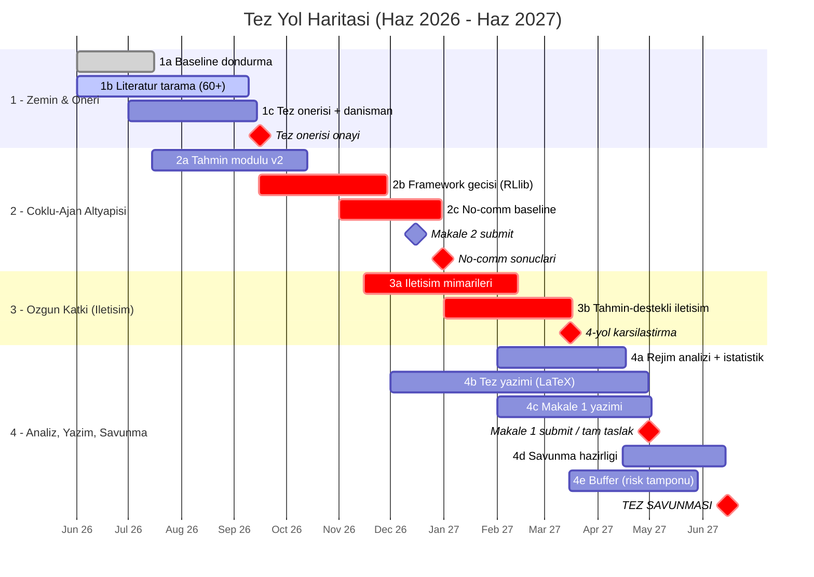
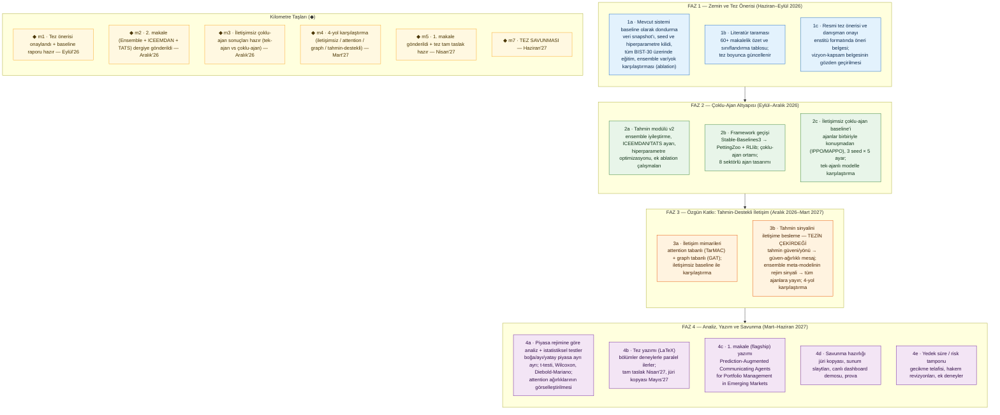

# Seminer Sunumu — 10 Slayt İçeriği (Notebook LM için)

**Kullanım:** Her slayt için **(a) başlık**, **(b) slayta yazılacak madde/metin**, **(c) konuşma metni (anlatım)**, **(d) görsel önerisi / nasıl üretilir** verilmiştir. Notebook LM'e slayt slayt verebilir, ya da bu dosyayı kaynak olarak yükleyip aşağıdaki prompt'u verebilirsin. Görselleri kendin Plotly/draw.io/Excalidraw/mermaid.live ile veya bu repodaki dashboard ekran görüntüleriyle üretebilirsin.

**Sunum süresi tahmini:** 13-17 dakika (slayt başına ~1-1.5 dk; Gantt ve yayın slaytları kısa tutulabilir).
**Dil:** Türkçe. Teknik terimler (DRL, MARL, ensemble, attention) İngilizce bırakılabilir.

---

## 📋 Notebook LM Prompt'u (kopyala-yapıştır)

> **Yüklenecek kaynak(lar):** Bu dosya (`seminar-presentation.md`) — istersen yanına `seminar-overview.md`'yi de ekle, daha zengin bağlam için. Notebook LM'de "Studio → Slayt Sunumu / Presentation" seçeneği yoksa bunun yerine bir "Briefing Doc" ya da "Study Guide" üretip slaytları kendin PowerPoint'e dökebilirsin; prompt aynı kalır.

```text
Yüklediğim kaynak(lar) bir yüksek lisans tezinin seminer sunumu için hazırlanmış içerik notlarıdır. Bu notlara dayanarak 11 slaytlık bir akademik seminer sunumu üret.

BAĞLAM: Konu, BIST-30 hisseleri için derin pekiştirmeli öğrenme (DRL) tabanlı bir portföy/işlem sistemi. Faz 1-3 tamamlandı (tek-ajanlı, tahmin-destekli, production kalitesinde sistem); tezde sektör-bazlı çoklu-ajan + ajanlar arası tahmin-destekli iletişim paradigmasına geçilecek. Hedef kitle: tez danışmanı ve seminer dersi jürisi/öğrencileri.

SLAYT YAPISI (sırayla, kaynaktaki "Slayt 1 ... Slayt 11" başlıklarını izle):
1. Kapak  2. Problem ve motivasyon  3. Tek-ajanın sınırları → tezin çıkış noktası  4. Araştırma sorusu (AQ1/AQ2/AQ3)  5. Bugüne kadar yapılanlar (Faz 1-3)  6. Sistem mimarisi (Veri → Tahmin → RL)  7. Özgün katkı: tahmin-destekli (trust-weighted) iletişim  8. Literatürdeki boşluk  9. 12 aylık zaman planı / Gantt (Haz 2026 → Haz 2027)  10. Beklenen çıktılar: makale, bildiri, poster  11. Özet ve danışmana sorular

HER SLAYT İÇİN ŞUNLARI ÜRET:
- Kısa, net bir BAŞLIK (en fazla 1 satır).
- 4-6 madde işaretli MADDE (her madde tek satır, kısa; slayta yazılacak metin — paragraf değil).
- 3-5 cümlelik KONUŞMA NOTU (sunumcunun o slaytta söyleyeceği akıcı anlatım; doğrudan kaynaktaki "Konuşma metni" bölümlerini temel al).
- Bir GÖRSEL ÖNERİSİ (1 cümle: ne tür şema/grafik/ekran görüntüsü konulmalı).

TON VE DİL:
- Dil: Türkçe. Akademik ama anlaşılır; jargon yığını yok.
- Genel kabul görmüş İngilizce teknik terimleri olduğu gibi bırak: DRL, MARL, ensemble, attention, GNN/graph, baseline, walk-forward, Sharpe, vb. Türkçeleştirmeye çalışma.
- Abartılı/pazarlama dili kullanma; "ilk", "en iyi" gibi iddialar yalnızca kaynakta açıkça yazıyorsa.
- Sonuç/rakam UYDURMA — sistem henüz tam eğitilmedi; "beklenen", "hedeflenen" dilini kullan. Kaynakta olmayan hiçbir sayı, dergi adı veya tarih ekleme.

ÇIKTI FORMATI: Her slaytı "## Slayt N — [Başlık]" şeklinde başlat; altında "Maddeler:", "Konuşma notu:", "Görsel:" alt başlıkları olsun. Sunumun en sonuna 3-4 cümlelik kısa bir "Sunum akışı özeti / sunumcu için ipuçları" ekle (süre yönetimi: 13-17 dk, slayt başına ~1.5 dk; hangi slaytlarda daha uzun durulmalı).

NOTLAR:
- Slayt 9'daki Gantt için: kaynakta Mermaid bloku var; sen sadece sözel özetini ve madde listesini üret (4 faz: Zemin&Öneri / Çoklu-Ajan Altyapısı / Özgün Katkı / Analiz-Yazım-Savunma + kilometre taşları). Görseli ben mermaid.live'dan PNG olarak ekleyeceğim.
- Slayt 5 ve 11'de "canlı dashboard ekran görüntüsü" görsel önerisi yap (projede çalışan bir Dash paneli var).
- Slayt 10'da makale/dergi/konferans adlarını yalnızca kaynaktan al (Expert Systems with Applications, Neurocomputing, Information Sciences, ICAIF, AAMAS, SIU, UBMK vb.).
```

**Tek satırlık kısa varyant (acele için):**
```text
Yüklediğim "seminer sunumu içerik notları" dosyasına dayanarak 11 slaytlık akademik bir seminer sunumu üret. Her slayt için: kısa başlık + 4-6 madde işaretli satır + 3-5 cümle konuşma notu + 1 cümle görsel önerisi. Dil Türkçe, teknik terimler (DRL, MARL, ensemble, attention) İngilizce kalsın. Kaynakta olmayan sayı/dergi/tarih ekleme; sonuç uydurma, "beklenen" dilini kullan. Slayt sırası: Kapak / Problem / Tek-ajanın sınırları / Araştırma sorusu / Yapılanlar (Faz 1-3) / Sistem mimarisi / Özgün katkı (trust-weighted iletişim) / Literatür boşluğu / 12 aylık Gantt / Çıktılar (makale-bildiri-poster) / Özet+sorular.
```

---

## Slayt 1 — Kapak

**Başlık:** Çoklu-Ajan Pekiştirmeli Öğrenmede Tahmin-Destekli İletişim — BIST-30 Portföy Yönetimi

**Slayt metni:**
- Yüksek Lisans Tez Çalışması — Seminer Sunumu
- Öğrenci: (ad-soyad) · Danışman: (ad-soyad)
- (Üniversite / Enstitü / Bölüm) · 2026
- Alt başlık: "Tek-ajanlı DRL trading sisteminden, sektör-bazlı çoklu-ajan + iletişim paradigmasına"

**Konuşma metni:** Bugün size yüksek lisans tez projemi tanıtacağım. Proje, BIST-30 hisselerinde derin pekiştirmeli öğrenme ile alım-satım kararı veren bir sistem; bugüne kadar tek-ajanlı çalışan, tahmin destekli bir altyapı kurdum, tezde bunu çoklu-ajan ve ajanlar arası iletişim paradigmasına taşıyacağım.

**Görsel:** Sade kapak. Arka planda hafif soluk bir BIST-30 fiyat grafiği veya bir ajan-ağı (node-link) illüstrasyonu. Renkler: koyu lacivert + beyaz, tek vurgu rengi.

---

## Slayt 2 — Problem ve Motivasyon

**Başlık:** Neden Bu Problem? — Portföy Yönetimi + DRL

**Slayt metni:**
- Portföy/işlem problemi: sınırlı bütçeyle, çoklu varlık arasında zaman içinde alım-satım kararı
- Klasik yöntemler (Markowitz, Black-Litterman, Risk Parity) → parametrik varsayımlara dayanır (normallik, durağan kovaryans)
- Gerçek piyasa bunları bozar: rejim değişimleri, fat-tail dağılımlar, likidite şokları
- BIST özelinde ek zorluk: yüksek enflasyon, TL volatilitesi, TCMB faiz politikaları
- Çözüm önerisi: **Derin Pekiştirmeli Öğrenme (DRL)** — model-serbest; ajan getiri-risk ödünleşimini doğrudan deneyimle öğrenir

**Konuşma metni:** Portföy yönetimi, sınırlı bir bütçeyle birden çok riskli varlık arasında zaman içinde karar verme problemi. Klasik yaklaşımlar getirilerin normal dağıldığı, kovaryansın durağan olduğu gibi varsayımlara dayanıyor — ama gerçek piyasa, hele Türkiye gibi yüksek enflasyonlu bir piyasa, bu varsayımları sürekli bozuyor. Derin pekiştirmeli öğrenme burada model-serbest bir alternatif sunuyor: piyasayı önceden modellemeden, ajan getiri ve risk arasındaki dengeyi doğrudan deneyimden öğreniyor.

**Görsel:** İki kutulu karşılaştırma. Sol: "Klasik (Markowitz...)" — varsayımlar listesi, çatlamış ikon. Sağ: "DRL" — "deneyimden öğrenir" akış oku. Altta küçük bir BIST-100 grafiği üstüne işaretlenmiş "2018 dalgalanma / 2021 enflasyon / 2024 rejim" etiketleri.

---

## Slayt 3 — Tek-Ajanın Sınırları → Tezin Çıkış Noktası

**Başlık:** Tek-Ajan Neden Yetmiyor?

**Slayt metni:**
1. **Ölçeklenme:** Varlık sayısı ↑ → state/action uzayı büyür; BIST-30'da state ~800+
2. **Heterojenlik yok:** Tek politika "banka hissesi" ile "teknoloji hissesi" için aynı mekanizmayı kullanır
3. **Koordinasyon/iletişim yok:** Varlıklar arası korelasyon yapısı yalnızca observation'a "çakılı" — haber/etki akışı açık değil
4. **Yorumlanabilirlik sınırlı:** Tek ajanın kararı yalnızca feature-importance ile kısıtlı biçimde açıklanır
- ⇒ Doğal soyutlama: **her sektörü ayrı bir ajan** olarak modelle, ajanlar **birbiriyle konuşsun**

**Konuşma metni:** Literatürdeki çoğu çalışma ve benim mevcut sistemim portföyü tek bir ajanın gözünden modelliyor — tüm hisseleri tek bir vektörde görüyor, tek bir aksiyon vektörüyle karar veriyor. Bunun dört yapısal zaafı var: varlık sayısı arttıkça ölçeklenmiyor, sektörel farklılıkları tek politikada çözmek zor, varlıklar arası bilgi akışını açıkça modellemiyor, ve kararları yeterince açıklanabilir değil. Finansal piyasalar zaten doğası gereği çoklu-ajan sistemler — bu yüzden her sektörü ayrı bir ajan olarak modellemek ve ajanların birbiriyle konuşmasını sağlamak yapay değil, doğal bir adım.

**Görsel:** Solda "Tek ajan" — bir kutu, içine sıkışmış 30 hisse ikonu, çıkışta tek kalın ok. Sağda "Çoklu ajan" — 8 sektör ajanı (Banka, Enerji, Sanayi, ...) node'ları, aralarında çift yönlü mesaj okları. Net "before / after" kontrastı.

---

## Slayt 4 — Tez Araştırma Sorusu

**Başlık:** Araştırma Sorusu ve Alt Sorular

**Slayt metni:**
- **Ana soru:** BIST-30 portföy yönetiminde, her sektörün bağımsız bir ajan olarak modellendiği ve ajanlar arasında **tahmin-destekli iletişimin** bulunduğu çoklu-ajan RL çerçevesi; tek-ajanlı alternatiflere göre **(i)** risk-ayarlı getiri, **(ii)** rejim uyumu, **(iii)** yorumlanabilirlik açısından ne düzeyde üstünlük sağlar?
- **AQ1 — Mimari:** Hangi iletişim mimarisi en iyi? (no-comm / attention / graph)
- **AQ2 — Tahmin sinyali:** Ensemble tahminini (güven, yön, rejim) iletişime beslemek koordinasyonu nasıl etkiler?
- **AQ3 — Rejim-duyarlılık:** İletişimin değeri boğa / ayı / yatay rejimde nasıl değişir?

**Konuşma metni:** Tezimin ana sorusu şu: sektör-bazlı çoklu-ajan RL ve ajanlar arası tahmin-destekli iletişim, tek-ajanlı çözümlere kıyasla risk-ayarlı getiri, rejim uyumu ve yorumlanabilirlikte ne kadar fark yaratıyor? Bu üç alt soruya bölünüyor: hangi iletişim mimarisi en iyi sonucu veriyor, tahmin sinyalini iletişime beslemek koordinasyonu nasıl değiştiriyor, ve iletişimin faydası farklı piyasa rejimlerinde nasıl değişiyor.

**Görsel:** Üstte büyük puntoyla ana soru (tırnak içinde). Altta üç eşit sütun: AQ1 (mimari ikonu — üç şema küçük), AQ2 (tahmin → mesaj oku), AQ3 (boğa/ayı/yatay üç mini grafik). Minimal, metin ağırlıklı.

---

## Slayt 5 — Bugüne Kadar Yapılanlar: 3 Faz

**Başlık:** Tamamlanan Çalışma — Faz 1 → Faz 3 (Ansari et al. 2024 temelli)

**Slayt metni:**
- **Faz 1 — Proof of Concept:** 5 hisse · Gymnasium çok-hisse ortamı · Stable-Baselines3 (A2C/PPO/TD3) · 56-boyutlu state · FastAPI + ilk dashboard
- **Faz 2 — Çok-Modelli Tahmin Sistemi:** veri katmanı (OHLCV + makro/EVDS + fundamental + altın) · 10 grup feature engineering (leakage yok) · feature selector (MI + permutation) · **5 model** (XGBoost + LightGBM + CatBoost + BiLSTM + TFT) + **stacking ensemble** · Optuna HPO · walk-forward + purge/embargo · tahmin çıktısı RL state'ine eklendi (+4×N) · PSR reward · 8-sayfa Dash dashboard
- **Faz 3 — Production İyileştirmeleri:** bug fix'ler (reward, data leakage, embargo, direction head...) · **ICEEMDAN** gürültü filtresi · **TATS** trend düzeltici · global makro (VIX, US10Y, DXY) · **ATR + Kelly** pozisyon boyutlandırma · **SHAP** açıklanabilirlik · Sortino/Calmar/Deflated Sharpe/Turnover metrikleri

**Konuşma metni:** Bugüne kadar üç fazı tamamladım, hepsi Ansari ve arkadaşlarının 2024 makalesini BIST-30'a uyarlayıp genişletiyor. Faz 1, beş hisse üzerinde çalışan temel RL ortamı ve dashboard. Faz 2, asıl katma değer: TCMB EVDS'ten makro veri, fundamental veri, on grup özellik, beş ayrı tahmin modeli ve bunları birleştiren bir stacking ensemble — hepsi walk-forward, leakage'sız. Tahmin çıktısı RL ajanının gözlemine ekleniyor. Faz 3 ise sistemi production kalitesine taşıdı: kritik bug'lar düzeltildi, gürültü filtreleme, trend düzeltme, VIX gibi global makro göstergeler, ATR ve Kelly tabanlı risk yönetimi, ve SHAP ile açıklanabilirlik eklendi.

**Görsel:** Yatay zaman çizelgesi — 3 büyük blok (Faz 1 / Faz 2 / Faz 3), her blokta 3-4 anahtar ikon ve "✅ tamamlandı" rozeti. Renk: tamamlananlar yeşil tonları. Alternatif: bu repodaki Dash dashboard'un ekran görüntüsü (home sayfası) küçük bir köşede.

---

## Slayt 6 — Sistem Mimarisi (Üst Düzey)

**Başlık:** Sistem Mimarisi — Veri → Tahmin → RL

**Slayt metni (akış şeması — kutular):**
- **VERİ:** yfinance (OHLCV) · TCMB EVDS (faiz, enflasyon) · yfinance (USD/TRY, BIST100, VIX, US10Y, DXY) · fundamental (ROE/ROA/PE/PB) · altın
- ↓
- **ÖZELLİK:** feature_engineer (10 grup, ICEEMDAN, ≥1 gün gecikme) → feature_selector (MI + permutation)
- ↓
- **TAHMİN:** XGBoost + LightGBM + CatBoost + BiLSTM + TFT → Stacking ensemble (Ridge/XGB meta, 3-yönlü split) → TATS düzeltici → çıktı: getiri / yön / güven / uyum + SHAP
- ↓ (+4 feature × sembol)
- **RL:** Gymnasium çok-hisse ortamı · state = bakiye + hisseler + OHLCV + indikatör + tahmin · reward = PSR · risk = ATR + Kelly · ajan = A2C/PPO/TD3
- ↓
- **DEĞERLENDİRME:** Sharpe, Sortino, Calmar, Deflated Sharpe, Profit Factor, Turnover, MaxDD · experiment tracker · FastAPI + Dash dashboard

**Konuşma metni:** Sistem üç katmandan oluşuyor. Veri katmanı yfinance ve TCMB EVDS'ten OHLCV, makro, fundamental ve global göstergeleri çekiyor. Özellik katmanı bunlardan on grup özellik üretiyor — hepsi en az bir gün gecikmeli, yani look-ahead bias yok — ve otomatik özellik seçimi yapıyor. Tahmin katmanında beş model walk-forward eğitiliyor, stacking ile birleşiyor, TATS ile trend düzeltmesi alıyor, çıktısı SHAP ile açıklanıyor. Bu çıktı RL ajanının gözlemine ekleniyor. RL katmanı Gymnasium tabanlı, PSR ödülü ve opsiyonel ATR/Kelly risk yönetimi kullanıyor. En sonda kapsamlı bir değerlendirme katmanı ve izleme için FastAPI + Dash dashboard var.

**Görsel:** Dikey akış diyagramı, 4-5 kutu, aralarında oklar; her kutu içinde kullanılan kütüphane logoları (PyTorch, XGBoost, FastAPI, Plotly...). draw.io / Excalidraw ile temiz çizilir. Alternatif: bu dosyada §4'teki ASCII diyagramı temiz bir grafiğe çevir.

---

## Slayt 7 — Tezin Özgün Katkısı: Tahmin-Destekli İletişim

**Başlık:** Özgün Katkı — Confidence-Weighted (Trust-Weighted) Communication

**Slayt metni:**
- Her sektör ajanı kendi **tahmin güvenini** ve **yönünü** diğer ajanlara **mesaj** olarak gönderir
- Düşük güvenli ajan → diğerlerine **daha çok kulak verir** (attention ağırlığı güven/trust ile modüle edilir)
- Ensemble meta-learner'ın **rejim sinyali** tüm ajanlara broadcast edilir
- Literatürde doğrudan karşılığı **yok** → tek başına makale konusu
- Üç tasarım eksenine bağlanır: ajan = sektör (~8) · iletişim = no-comm / attention / GNN · ödül = bireysel + portföy karışımı

**Konuşma metni:** Tezin özgün katkısı şu fikir: her sektör ajanı sadece alım-satım kararı vermekle kalmıyor, kendi tahmin güvenini ve yönünü diğer ajanlara bir mesaj olarak gönderiyor. Güveni düşük olan ajan, diğer ajanların mesajlarına daha fazla ağırlık veriyor — yani attention mekanizması güven skoruyla modüle ediliyor. Ayrıca ensemble'ın meta-learner'ı bir piyasa rejimi sinyali üretiyor ve bu tüm ajanlara yayınlanıyor. Literatür taramamda bunun doğrudan bir karşılığını bulamadım; bu yüzden bu fikir başlı başına bir makale potansiyeli taşıyor.

**Görsel:** Merkez illüstrasyon: 8 sektör ajanı dairesel dizilmiş; aralarında mesaj okları, ok kalınlığı = "trust/confidence". Ortada "Ensemble → regime broadcast" bir radyo-dalga ikonuyla. Her ajan kutusunda küçük bir "confidence: 0.7" rozeti. Bu slaytın görseli sunumun "wow" görseli olmalı — Excalidraw veya Figma ile özenli çiz.

---

## Slayt 8 — Literatürdeki Boşluk ve Tezin Yeri

**Başlık:** Literatürdeki Boşluk — Tez Nereyi Dolduruyor?

**Slayt metni (tablo):**

| Boşluk | Literatürde durum | Bu tez |
|---|---|---|
| İletişim mimarileri karşılaştırması | Yok denecek kadar az — genelde tek mimari, tek baseline | **3 mimari** (no-comm / attention / GNN) sistematik karşılaştırma |
| Tahmin sistemi entegrasyonu | Sığ — observation'a ek feature | **İletişim kanalına besleme** (trust-weighted) |
| Gelişen piyasalar (BIST) | Multi-agent DRL çalışması yok denecek kadar az | **BIST-30**, EM-spesifik makro pipeline (EVDS + VIX/US10Y/DXY) |
| Rejim-bağımlı analiz | İletişimin faydası boğa/ayıda nasıl değişir — araştırılmamış | Rejim-bazlı **ablation** + istatistiksel test |

**Konuşma metni:** 2024-2026 literatürünü dört eksende taradım. Dört net boşluk var. Birincisi: MARL-finansta iletişim mimarilerini karşılaştıran çalışma neredeyse yok — genelde bir mimari seçilip bir baseline'a karşı test ediliyor. İkincisi: tahmin sistemi entegrasyonu sığ; observation'a ek feature olarak ekleniyor, iletişime beslenmiyor. Üçüncüsü: gelişen piyasalar, özellikle BIST üzerinde multi-agent DRL çalışması yok denecek kadar az. Dördüncüsü: iletişimin faydasının farklı piyasa rejimlerinde nasıl değiştiği hiç araştırılmamış. Tezim bu dördünü birlikte ele alıyor.

**Görsel:** 2×2 grid (boşluk haritası) — her hücrede bir boşluk başlığı, ortada "TEZ" etiketi dört hücreye uzanan oklarla. Veya yukarıdaki tabloyu temiz, az satırlı bir görsel tablo olarak. Üstte küçük "60+ makale tarandı" rozeti.

---

## Slayt 9 — 12 Aylık Zaman Planı (Gantt) — Haziran 2026 → Haziran 2027

**Başlık:** Yol Haritası — 12 Ay, 4 Faz, Savunma Haziran 2027

**Slayt metni (Gantt — 4 faz × 4 ana iş bandı):**
- **Faz A — Zemin & Öneri (Haz–Eyl'26):** baseline dondurma · literatür taraması (60+ makale) · resmi tez önerisi + danışman hizalama · tahmin modülü iyileştirme başlangıcı → *çıktı: onaylı tez önerisi + kanonik baseline raporu*
- **Faz B — MARL Altyapısı (Eyl–Ara'26):** tahmin modülü v2 tamam · SB3 → PettingZoo+RLlib geçişi · sektör-bazlı (~8 ajan) ortam · no-comm baseline (IPPO/MAPPO) · **Makale 2 submit (Ara'26)** → *çıktı: çalışan MARL ortamı + no-comm sonuçları*
- **Faz C — Özgün Katkı (Ara'26–Mar'27):** attention (TarMAC) + GNN (GAT) iletişim mimarileri · prediction-augmented communication (trust-weighted msg + regime broadcast) · 4-yol karşılaştırma → *çıktı: no-comm / attention / GNN / prediction-augmented sonuçları*
- **Faz D — Analiz, Yazım, Savunma (Mar–Haz'27):** rejim-bazlı ablation (boğa/ayı/yatay) + istatistiksel test · tez yazımı tamamlama (LaTeX) · **Makale 1 submit (Nis–May'27)** · savunma hazırlığı + demo · buffer → *çıktı: tez teslim + **SAVUNMA Haziran'27***
- **Kritik checkpoint'ler:** Eyl'26 (öneri onayı) · Ara'26 (no-comm çalışıyor mu? değilse 8→4-5 ajan) · Mar'27 (prediction-comm sonuç veriyor mu? değilse 3-mimari ile yetin) · Nis'27 (tez tam taslak hazır mı? değilse buffer devreye)

**Konuşma metni:** Tez savunmasını gelecek yıl haziranda hedefliyorum — yaklaşık 12 aylık bir plan. Dört faza böldüm. İlk faz, haziran-eylül: mevcut sistemi kanonik baseline olarak dondurma, literatür taraması ve resmi tez önerisi. İkinci faz, eylül-aralık: tahmin modülünü bitirme, framework geçişi, sektör-bazlı çoklu-ajan ortamı ve no-comm baseline; bu fazın sonunda ilk makaleyi submit ediyorum. Üçüncü faz, aralık-mart: tezin kalbi — attention ve GNN iletişim mimarileri, ve tahmin sistemini iletişime entegre eden özgün katkı, dört-yol karşılaştırma. Dördüncü faz, mart-haziran: rejim-bazlı analiz, tez yazımı, flagship makale submit, savunma hazırlığı, ve gecikme için bir tampon ay. Her faz sonunda bir checkpoint kararı var — bir şey yetişmiyorsa kapsamı daraltarak ilerliyorum.

**Görsel:** İki PNG kullan — (1) takvim Gantt'ı (x ekseni 12 ay, 4 faz, ◆ milestone'lar), (2) faz kartı (renkli bloklarda adım açıklamaları). İkisini de aşağıdaki Mermaid bloklarından **mermaid.live**'a yapıştırıp **"Light" tema** ile PNG indir. Slaytta Gantt'ı bir slayda, faz kartını yanına/sonrasına (yedek slayda) koyabilirsin. (Bu dosyada eskiden bir ASCII Gantt vardı; eşit-genişlikli font olmadan hizalanmadığı için kaldırıldı — Mermaid PNG her yerde düzgün çıkar.)

**1) Takvim Gantt'ı (mermaid.live → Light tema → PNG):**

> Görev adları kasıtlı **kısa**; detaylı açıklamalar altta tablo + faz kartında. `active` = şu an çalışılan, `crit` = kritik yol, `done` = tamamlanmış zemin, ◆ = milestone.



**Adım açıklamaları (Mermaid'deki kısa kodların karşılığı — slaytta konuşmacı notu olarak da kullanılabilir):**

| Kod | Adım | Açıklama |
|---|---|---|
| **1a** | Baseline'ı dondurma | Faz 1-3 sistemini "kanonik baseline" yap: veri snapshot'ı, seed/hiperparametre kilidi, tüm BIST-30 eğitim (30 hisse, 200K adım, 3 seed), ensemble var/yok karşılaştırması (ablation) |
| **1b** | Literatür taraması | 60+ makalelik özet/taksonomi tablosu (MARL + portföy + iletişim + tahmin); süreç boyunca güncellenir |
| **1c** | Tez önerisi + danışman | Enstitü formatında resmi öneri; vizyon-kapsam belgesinin danışmanla gözden geçirilip onaylanması |
| **2a** | Tahmin modülü v2 | Ensemble iyileştirme, ICEEMDAN/TATS ayarı, hiperparametre optimizasyonu (HPO) derinleştirme, ek ablation çalışmaları |
| **2b** | Framework geçişi | SB3 → PettingZoo + RLlib; çok-ajan ortam (`marl_trading_env.py`); 8-sektör ajan tasarımı |
| **2c** | No-comm baseline | İletişimsiz çok-ajan baseline (IPPO/MAPPO), 3 seed × 5 konfig; tek-ajan ile karşılaştırma |
| **3a** | İletişim mimarileri | Attention (TarMAC) + graf (GAT) iletişim mimarileri implementasyonu ve no-comm ile karşılaştırma |
| **3b** | Tahmin-destekli iletişim | **Tezin çekirdeği:** tahmin güveni/yönü → güven-ağırlıklı mesaj; meta-learner rejim sinyali → broadcast; 4-yol karşılaştırma |
| **4a** | Rejim analizi + istatistik | Boğa/ayı/yatay piyasa ayrı ayrı + istatistiksel test (t-testi, Wilcoxon, Diebold-Mariano) + attention ağırlıklarının görselleştirilmesi |
| **4b** | Tez yazımı | LaTeX; bölümler deneylerle paralel; tam taslak Nis'27, jüri kopyası May'27 |
| **4c** | Makale 1 yazımı | Flagship: *Prediction-Augmented Communicating Agents for Portfolio Management in Emerging Markets* |
| **4d** | Savunma hazırlığı | Jüri kopyası, slaytlar, canlı dashboard demo, prova |
| **4e** | Buffer | Risk tamponu — gecikme telafisi, hakem revizyonu, ek deney |
| ◆ **m1** | Tez önerisi onayı | + kanonik baseline raporu hazır (Eyl'26) |
| ◆ **m2** | Makale 2 submit | Ensemble + ICEEMDAN + TATS makalesi gönderildi (Ara'26) |
| ◆ **m3** | No-comm sonuçları | Tek-ajan vs no-comm karşılaştırması hazır (Ara'26) |
| ◆ **m4** | 4-yol karşılaştırma | no-comm / attention / GNN / tahmin-destekli (Mar'27) |
| ◆ **m5** | Makale 1 submit + tam taslak | Flagship gönderildi, tez tam taslak hazır (Nis'27) |
| ◆ **m7** | Tez savunması | Haz'27 |

> **Mermaid kullanım notu:** Kodu **mermaid.live**'a yapıştır → "Actions → PNG/SVG" indir. Koyu/okunmaz görünüyorsa sağ üstten **"Light" temaya geç**. Slaytta küçük kalıyorsa Config sekmesinden `fontSize` büyüt. Notebook LM mermaid render etmiyorsa PNG'yi slayda manuel ekle.

**2) Faz kartı — AYRI bir görsel (Mermaid `flowchart`; Gantt PNG'sinin yanına ikinci PNG olarak indir):**

> Gantt'ta sadece `1a, 2b, 3b...` kısa kodları görünür; bu kart o kodların açılımını gösteren "lejant". Slaytta Gantt'ı bir slayda, bu kartı yanına veya bir sonraki slayda (yedek slayt) koyabilirsin. mermaid.live → Light tema → PNG. (Mermaid gerçek tablo desteklemez; bu yüzden flowchart grid'i kullanıyoruz — çıktı düzgün bir kart panosu olur.)

> Not: "ablation (ayrıştırma analizi)" = sistemin her bileşenini tek tek çıkarıp/ekleyip katkısını ölçme (örn. "ensemble'lı vs ensemble'sız", "iletişimli vs iletişimsiz"). Genel kabul görmüş İngilizce terimler (seed, snapshot, baseline, ensemble, attention, framework, walk-forward, drawdown) olduğu gibi bırakıldı.



---

## Slayt 10 — Beklenen Çıktılar: Makale, Bildiri, Poster

**Başlık:** Akademik Çıktılar — Hangi Dergilere, Hangi Konferanslara?

**Slayt metni:**
- **Makale 1 (flagship, ~Nis-May'27 submit):** *Prediction-Augmented Communicating Agents for Portfolio Management in Emerging Markets* → **Expert Systems with Applications** / **Applied Soft Computing** / **Engineering Applications of AI** / **Knowledge-Based Systems** (Q1)
- **Makale 2 (erken yayın, ~Kas-Ara'26 submit):** *Ensemble Prediction with ICEEMDAN Denoising & TATS Correction for RL Trading: A BIST-30 Study* → **Neurocomputing** / **Knowledge-Based Systems** (Q1) · **Applied Intelligence** / **Computational Economics** / **Financial Innovation** (Q1-Q2) — *deneyler hazır, düşük risk*
- **Makale 3 (yöntem):** *Trust-Weighted Message Passing in Multi-Agent Portfolio Management* → **Information Sciences** / **IEEE TNNLS** / **Neural Networks** / **Pattern Recognition** (Q1)
- **Makale 4 (ulusal, TR Dizin):** Türkçe → **Politeknik Dergisi** / **Gazi MMF** / **Pamukkale Müh. Bil.** / **JISTA**
- **Opsiyonel:** M5 — *MARL for Portfolio Management: A Survey* (**Artificial Intelligence Review** / **ACM Computing Surveys**) · M6 — veri/altyapı notu (**Data in Brief** / **SoftwareX**)
- **Konferans / poster:** **ICAIF** (ACM AI in Finance) · **AAMAS** (multi-agent — extended abstract, deadline Kasım'26!) · **SIU** / **UBMK** / **ASYU** (ulusal+IEEE) · **CIFEr** / **IJCNN** · enstitü lisansüstü araştırma günü posteri
- **Diğer:** açık kaynak repo + Zenodo DOI · canlı dashboard demo (savunmada) · YÖK Tez Merkezi (açık erişim tez)
- **Strateji:** önce M2 (risk düşük, erken yayın) → C2/C3 ile görünürlük → M1 flagship (tez deneyleri bitince) → M3/M4 yazımla paralel

**Konuşma metni:** Tezin modüler yapısı birden çok yayın çıkarmaya uygun. Stratejim önce düşük riskli olanı çıkarmak: Makale 2, ensemble tahmin sistemini anlatıyor, deneyleri büyük ölçüde hazır, aralık civarı submit edebilirim — Neurocomputing veya Knowledge-Based Systems gibi Q1 dergilere. Asıl flagship makale, tezin özgün katkısını anlatan, Expert Systems with Applications veya Applied Soft Computing hedefli; onu deneyler bitince, nisan-mayıs civarı submit ediyorum. Üçüncü makale iletişim mekanizması odaklı, Information Sciences veya IEEE TNNLS. Bir de Türkçe ulusal makale, Politeknik Dergisi gibi TR Dizin'de. Konferans tarafında ICAIF — finans-AI'ın amiral konferansı — ve AAMAS — multi-agent sistemlerin ana konferansı; AAMAS'ın extended abstract deadline'ı kasımda, ona erken bakmam lazım. Ulusal tarafta SIU, UBMK, ASYU posterleri. Ayrıca açık kaynak repo ve canlı dashboard demosu.

**Görsel:** Üç sütun: **Dergiler** (4-6 satır, her satırda makale adı + hedef dergi logoları/isimleri, Q1 rozetleriyle), **Konferanslar/Posterler** (ICAIF, AAMAS, SIU, UBMK... logoları), **Diğer çıktılar** (GitHub, Zenodo, dashboard ikonları). Veya bir "yayın hunisi" görseli: tepede tez → altında 4 makale dalı + konferans dalı + repo dalı. Risk düzeyini renkle göster (M2 yeşil = düşük risk, M1/M3 amber = deney bağımlı). Dergi logoları (Elsevier, IEEE, Springer) slaytı zenginleştirir.

---

## Slayt 11 — Özet ve Danışmana Sorular

**Başlık:** Özet — ve Tartışmaya Açık Noktalar

**Slayt metni:**
- **Yapıldı:** Tek-ajanlı, tahmin-destekli, production-grade DRL trading sistemi (Faz 1-3) — 5 model ensemble, ICEEMDAN, TATS, ATR/Kelly, SHAP, 8-sayfa dashboard
- **Yapılacak:** Sektör-bazlı çoklu-ajan + öğrenilmiş iletişim + tahminin iletişime entegrasyonu (özgün katkı) + rejim-bazlı ablation
- **Beklenen katkı:** EM (BIST) zemininde, tahmin-destekli iletişim mimarilerinin ilk sistematik karşılaştırması; 3-4 makale potansiyeli
- **Danışmana sorular:**
  1. Ajan granülaritesi: sektör-bazlı (~8) yeterince özgün mü, hiyerarşik riske değer mi?
  2. İletişim mimarisi: 3 karşılaştırma mı, 2'ye mi indirelim?
  3. Erken yayın: Makale 2'yi Milestone 1'de submit etmek mantıklı mı?
  4. Veri dönemi 2018-2026 rejim analizi için yeterli mi?
  5. Baseline'a klasik yöntemler (buy&hold, equal-weight, mean-variance) eklensin mi?
  6. Framework: PettingZoo+RLlib geçişi mi, SB3 custom wrapper mı?

**Konuşma metni:** Özetle: bugüne kadar tek-ajanlı, tahmin destekli, production kalitesinde bir DRL trading sistemi kurdum. Tezde bunu sektör-bazlı çoklu-ajana, ajanlar arası öğrenilmiş iletişime ve tahmin sisteminin bu iletişime entegrasyonuna taşıyacağım — bu son nokta özgün katkım. Beklenen katkı, BIST gibi bir gelişen piyasada tahmin-destekli iletişim mimarilerinin ilk sistematik karşılaştırması ve buradan 3-4 makale. Şu noktalarda görüşünüzü almak isterim: ajan granülaritesi, kaç iletişim mimarisi karşılaştıralım, erken yayın stratejisi, veri dönemi yeterliliği, klasik baseline eklenmesi ve framework seçimi. Teşekkür ederim.

**Görsel:** İki sütun — sol "✅ Yapıldı" (3-4 madde + küçük dashboard ekran görüntüsü), sağ "⏭️ Yapılacak" (3-4 madde + mini ajan-ağı görseli). Altta "Sorular" için sade numaralı liste. Kapanış için temiz, az renkli düzen.

---

## Notebook LM / Sunum Üretim İpuçları

- **Tek prompt ile üretmek istersen:** Bu dosyayı (`seminar-presentation.md`) ve `seminar-overview.md`'yi kaynak olarak yükle, sonra: *"Bu iki belgeye dayanarak akademik bir seminer sunumu için 11 slaytlık içerik üret. Her slayt için başlık, 4-6 madde ve kısa konuşma notu yaz. Dil Türkçe, ton akademik ama anlaşılır. Teknik terimleri İngilizce bırak."*
- **Görseller:** Slayt 3, 6, 7 görselleri sunumun belkemiği — bunlara zaman ayır. draw.io / Excalidraw / Figma yeterli. Slayt 9 (Gantt) için: Slayt 9'daki iki Mermaid bloğunu (takvim Gantt'ı + faz kartı) mermaid.live'a yapıştır → "Light" tema → PNG indir → slayda ekle. Slayt 5 ve 11'de bu repodaki Dash dashboard'un ekran görüntülerini kullan (`python run_server.py` → `http://localhost:8000/dash/`).
- **Logo/ikon:** PyTorch, XGBoost, LightGBM, CatBoost, FastAPI, Optuna, Plotly logoları slayt 6'yı zenginleştirir.
- **Renk paleti:** Koyu lacivert (#1a2332) + beyaz + tek vurgu (turkuaz #2ec4b6 veya amber #ff9f1c). Tamamlanan işler yeşil, gelecek işler vurgu rengi.
- **Süre:** 12-15 dk hedefle; her slaytta 1-1.5 dk. Slayt 5, 6, 7'de biraz daha uzun durabilirsin.
- **Yedek slaytlar (isteğe bağlı, ana akışın dışında):** (a) Detaylı sistem mimarisi (kod modül haritası), (b) Ansari et al. 2024 metodolojisi özeti, (c) Değerlendirme metrikleri tanımları (Deflated Sharpe Ratio nedir?), (d) Yapılabilirlik/hesaplama bütçesi tablosu, (e) Risk haritası. Soru gelirse aç.
